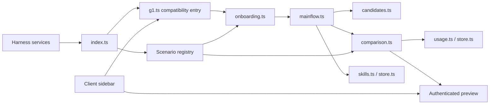

# Architecture and Code Map

Current version: g2.5. See the [framework](FRAMEWORK.md) for product scope. Executable schemas in source define the authoritative fields. This map helps contributors locate changes without copying the core flow into each scenario.

## Composition

One TypeScript package builds the host plugin and React sidebar. Harness supplies models, credentials, Skill registration, Agent sessions, browser authentication, and communication. RSI owns user authorization, candidates, comparisons, versions, and accounting.

## Responsibilities

| Change | Entry point | Boundary to preserve |
|---|---|---|
| Skill types, recognition, output format | `src/scenarios/` | Does not own authorization, tokens, or ACTIVE |
| Task interception and explicit `/skill-name` | `src/onboarding.ts` | Requires an explicit Skill or a matching scenario; does not intercept all chat |
| Confirmation, clarification, iteration, adoption | `src/mainflow.ts` | Check revision, source, digest, and budget before writes |
| Candidate validation | `src/candidates.ts` | Authorized copies only, immutable after sealing; no output quality decisions |
| Paired execution, compilation, links | `src/comparison.ts` | Same frozen conditions, two independent requests; failures remain failures |
| Usage and time | `src/usage.ts`, `src/comparison-metrics.ts` | Record before dispatch; unknown is not zero |
| State and migration | `src/store.ts` | SQLite transactions, idempotent operations, retained history |
| Content-addressed Skills | `src/skills.ts` | Separate original directories, immutable objects, and active pointers |
| Earlier observation/design preparation | `src/g1.ts`, `src/frontend.ts` | Preserve protocol compatibility; new scenario logic belongs elsewhere |
| Charts and feedback | `src/client/comparison.tsx` | No client-side billing, scoring, or direct ACTIVE writes |
| Web-specific guidance | `src/client/design-start.tsx` | Frontend-only assistance, not a closed taxonomy for core input |

Historical names such as g1, mainflow, and g0.sqlite remain to reduce compatibility cost. Candidate validation, comparisons, and scenarios were extracted along actual responsibilities; there is no service or package for every object.

## Call chain

1. `index.apply` opens storage, provides the scenario registry, registers usage observation, and composes business services.
2. `onboarding` resolves explicit Skills; otherwise it uses scenario `matchesRequest`. Directory-backed non-web Skills fall back to text.
3. `mainflow.startPage` (historical internal name) seals the baseline, pins the scenario version, creates a confirming card, and pauses the dependent task.
4. `flow_authorize` freezes complete input, paths, preferences, and budget. Generation returns candidate, clarification, or unchanged.
5. `checkCandidate` validates and seals files, entering review. The user can use the original review path or start a comparison.
6. `flow_compare` freezes both inputs and a separate budget. Core code calls the model; the scenario compiles. Each output records its digest, status, and duration.
7. `flow_choose` verifies the exact candidate and expected ACTIVE. If comparison was started, candidate compilation and related usage must be confirmed. No functional/aesthetic score is read. The host then binds the version and dispatches an ordinary task.
8. `flow_revise` creates a child task with `parentId` and the selected previous version as a read-only reference. An unadopted parent candidate does not enter ACTIVE; parent evidence remains.

Comparison is a tool-free request, not another Agent Loop. It does not change daily-session Skill bindings. After adoption, actual project work continues through native Harness tools and its Agent Loop.

## Scenario interface

`SkillScenario` has four responsibilities:

- `info`: stable ID, version, readable label, and HTML/text presentation kind.
- `matchesSkill` / `matchesRequest`: selection; general text is a fallback and does not automatically intercept chat.
- `instructions`: shared output instructions, frozen together with user input.
- `compile(output, signal)`: validate output and return a bounded artifact plus check details. It receives neither a database nor an activation callback.

`ctx.rsiScenarios.register` returns an unregister function. Duplicate IDs fail. The most recently registered specific scenario takes priority, with text as fallback. Tasks pin versions; removed or changed implementations cannot silently continue a comparison. Increment the version when instructions or compilation semantics change.

This is an API for trusted host code, not a plugin security sandbox. Third-party host code has the trust level of other host plugins, even though the interface does not expose state-writing helpers.

## Data and compatibility

| Data | Authority | Storage |
|---|---|---|
| SkillSnapshot, UsageAttempt, binding | `src/contracts.ts` | SQLite and `rsi/objects/<digest>` |
| Revision task, parent, scenario, reference | `src/mainflow-contracts.ts` | `g1_state.mainflow.tasks` |
| Comparison budget, runs, artifact digests | `src/comparison-contracts.ts` | Task comparison |
| Scenario and artifact structure | `src/scenarios/contracts.ts` | Scenario code, snapshots, content files |
| Web operations | `src/g1-contracts.ts` | `g1_operations` receipts |
| Compiled artifacts | SHA-256 of content | `rsi/artifacts/<digest>` |

SQLite 6 adds default fields without changing old ledger/receipt semantics. Historical tasks default to frontend. Preferences gain `scenarioId` to prevent cross-type leakage. Failed migrations roll back rather than clear data. Back up the database, objects, and artifacts together.

The current single-machine JSON state is bounded: 256 tasks and 64 Skills. Limits are not automatic cleanup policies. Reaching them requires explicit migration or archival, never deletion of old accounting.

## Accounting, concurrency, and recovery

- Generation uses the revision task ID as ownerId; comparison uses its own ID, with separate sessionIds per side. Daily work retains the session owner.
- Baseline runs first, candidate second. Each is authorized once, without automatic retries. Numbers in model output are not usage evidence.
- Tokens come from the ledger. A monotonic host clock measures each request, compilation, and artifact sealing, excluding user waiting. Unreliable duration after interruption remains unknown.
- During generation/comparison, a task cannot change reference, adopt, or create another iteration; stopping remains possible. Other tasks can exist independently. Duration is an observation, not a contention-free benchmark.
- Stop/disposal aborts plugin-owned requests and reconciles state. Restart marks in-flight work failed/interrupted without paid replay. Completed comparisons remain viewable.
- ACTIVE updates check the expected previous version; concurrent cards cannot overwrite newer state. Session bindings are immutable.

## Preview boundary

`ctx.connection.fetch` registers `/api/rsi-preview`, reusing Harness Host/Origin checks and browser authentication. Reads verify the content digest and serve only complete compiled artifacts.

HTML uses CSP sandbox with scripts allowed but no same-origin privilege. CSP restricts networking, form submissions, external resources, and nested frames. Sidebar iframes add sandboxing. The same authenticated link opens a full-size local preview; this is not hosting.

Never execute preview HTML with Harness same-origin privileges or pass model-generated build commands straight to the host shell. External dependencies and multi-file projects need a controlled execution environment and cleanup contract first.
