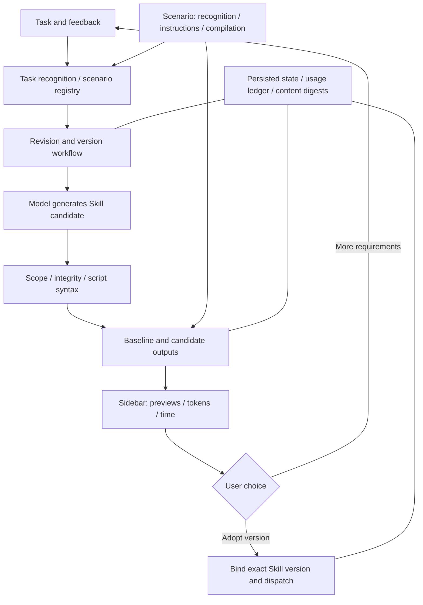

# DeepSeek RSI

**A Skill evolution plugin with users in control.** Inside DeepSeek Harness, revise a Skill from your requirements, compare the old and new outputs with previews, tokens, and elapsed time, then choose a version or give feedback for another iteration.

Repository: [B1ackB/DeepSeek-RSI](https://github.com/B1ackB/DeepSeek-RSI). Current development version: `0.0.0-g2.5`.

## Purpose

An Agent's behavior depends on the Skills it loads as well as its model: task methods, writing rules, reference material, and helper scripts. This project turns those editable resources into recorded, reviewable candidate versions so users can refine their Agents over time.

RSI here means **controlled iteration at the Skill layer**. The model interprets requirements and proposes edits. The host controls authorization, scope, versions, accounting, and compilation. The user decides whether a candidate is worth adopting. The plugin does not change model weights, the Harness controller, or its own permissions, and does not switch versions automatically in the background.

## Workflow

1. Submit a webpage request in Harness, or explicitly select another directory-backed Skill with `/skill-name task description`.
2. Confirm requirements, preference scope, complete input files, editable paths, and budget in the sidebar. Web tasks offer optional page-purpose and style cards; other scenarios use general requirement input.
3. The model produces an independent Skill candidate. The host validates scope, file integrity, and Python/Shell syntax, then shows the complete diff.
4. Optionally confirm a separate comparison budget to generate one output with each version. The sidebar shows embedded previews, links, token bars, and generation/compilation time. Usage comes from the provider ledger; unknown values remain unknown.
5. Adopt the candidate, continue with the baseline, or enter requirements for the next iteration. Another iteration preserves prior records and opens a linked confirmation card; preparing it makes no model call.
6. After adoption, the ordinary Harness task binds to the exact approved Skill version. If a session has used a different version, a linked session is created; the original retains its binding.

**Compilation is a technical threshold, not a quality score.** Fewer tokens do not automatically recommend or activate a candidate. Functional or aesthetic scores do not choose for the user. The original review path without output comparison remains available; once comparison starts, its candidate cannot be adopted until candidate compilation and related usage confirmation succeed.

## Supported scenarios

| Scenario | Comparison output | Checks | Current limits |
|---|---|---|---|
| Single webpage | Self-contained HTML, CSS, and vanilla JavaScript; separate preview links | CSS/JavaScript compilation and structured response format | No external dependencies or tools; not a multi-file project build. HTML is parsed by the browser |
| General text | Notes, explanations, writing, and other text previews | Nonempty text, size, and format | No additional project-file access or invented external execution results |
| Developer extension | HTML/text output generated under a trusted scenario's instructions | Scenario-specific compilation or format checks | Shares core accounting and version flow; more complex execution environments need explicit integration |

Web design is one built-in scenario. Other explicit directory Skills enter the general flow, and developers can register specific scenarios. Web project/personal preferences do not leak into general text scenarios.

## Architecture



One TypeScript plugin package contains the host and browser components. Small interfaces separate shared workflow from scenario-specific behavior. The browser submits intent; the host validates state transitions.

| Entry point | Responsibility |
|---|---|
| `src/index.ts` | Plugin lifecycle and service composition |
| `src/onboarding.ts` | Task entry and explicit Skill selection |
| `src/mainflow.ts` | Authorization, candidates, further iterations, exact adoption, and session handoff |
| `src/candidates.ts` | Candidate scope, integrity, and script syntax |
| `src/comparison.ts` | Frozen comparison input, execution, compilation, artifacts, and authenticated previews |
| `src/scenarios/` | Web/text scenarios and developer registration |
| `src/store.ts`, `src/usage.ts`, `src/skills.ts` | Transactions, provider usage, and immutable versions |
| `src/client/` | Shared sidebar, charts, and web guidance |
| `src/g1.ts`, `src/frontend.ts` | Compatible observation/analysis and earlier design preparation |

See [architecture](ARCHITECTURE.md) for call chains and trust boundaries, and [contributing](CONTRIBUTING.md) for an extension example.

## Development and validation

The integration pins DeepSeek Harness commit `d347e703908d0406b7a7ef80e3a0e594d86b2215` and requires the [right-panel patch](../patches/harness-right-panel.patch). The plugin declares Node >=24; local validation with the existing Harness native dependencies uses Node 25.8.1. Revalidate other Harness/Node combinations.

Apply the patch and build in a separate Harness checkout. Do not reapply an already applied patch:

```sh
# In the Harness checkout; RSI_REPO is this repository's absolute path.
git apply --check "$RSI_REPO/patches/harness-right-panel.patch"
git apply "$RSI_REPO/patches/harness-right-panel.patch"
pnpm run build
```

Then run in this repository:

```sh
npm ci --ignore-scripts
npm run link:harness -- /absolute/path/to/deepseek-harness
npm run check
```

The linking script checks the Harness commit and refuses to replace a different existing link. `npm run check` runs host/client type checks, Node tests, and the build. Tests do not call real models or start Docker. The existing esbuild dependency compiles both the plugin and comparison CSS/JavaScript.

For development, start from the built Harness checkout with a separate `DSH_HOME` and this repository's patch:

```sh
DSH_HOME=/absolute/path/to/rsi-dev-home DSH_TELEMETRY_MODE=DISABLED \
 node --import tsx/esm apps/cli/src/bin.ts web \
 --patch /absolute/path/to/DeepSeek-RSI/cordis.patch.yml --no-open
```

Use the authenticated launch link. Do not install a second RSI copy into the same profile. Harness manages credentials; do not commit authentication links, credentials, or local databases.

## Installation, upgrades, and data

Build a local package:

```sh
npm run build
mkdir -p .cache
npm pack --ignore-scripts --pack-destination .cache
```

Install from the patched Harness checkout, using your own `DSH_HOME`:

```sh
DSH_HOME=/absolute/path/to/rsi-home node --import tsx/esm apps/cli/src/bin.ts \
 plugin --profile web add /absolute/path/to/DeepSeek-RSI/.cache/b1ackb-deepseek-rsi-0.0.0-g2.5.tgz --ignore-scripts
```

Stop the profile's host and back up all of `DSH_HOME/rsi` before upgrading. This version migrates SQLite to **6**, preserving the ledger, receipts, and version records. Historical workflow records gain default scenario and empty comparison fields. Older packages cannot read version 6; roll back using a stopped-host backup. Uninstall with `plugin --profile web remove @b1ackb/deepseek-rsi` in the same profile; it does not clear RSI data.

Comparison artifacts live under `DSH_HOME/rsi/artifacts`, Skill versions under `objects`, and the database remains `g0.sqlite` for compatibility. Preview links require the running Harness and browser authentication. They are local previews, not public deployments; stopping the host or changing its port can invalidate an old address.

## Evidence and limits

- See the [g2.5 report](COLLABORATION-REPORT.md) for implementation and validation. Earlier g2.4 work and real experiment evidence are retained.
- The historical real experiment completed Skill rewriting and old/new single-page generation, but the candidate had an extra button with no feedback. Under the current rules, the user judges such behavior; the historical report's original conclusion remains preserved.
- Fixed-response tests establish workflow, accounting, and boundary behavior, not lasting model improvement. Every new paid batch requires its own explicit budget.
- This is a local development version on a pinned host. It has no unattended automatic selection, general multi-file builder, public preview hosting, team permission system, or marketplace.
- No open-source license has been selected; the package remains `private: true`. Publication and licensing are maintenance decisions still to be made. The extension entry point is not a promise of a stable cross-version SDK.
- Documentation is English. Runtime fixtures, original model outputs, confirmed inputs, and screenshots retain their source language and bytes so historical evidence remains verifiable. The product UI remains Chinese.

## Documentation index

| Need | Document |
|---|---|
| Purpose, workflow, installation | This README |
| Product boundaries and roadmap | [FRAMEWORK.md](FRAMEWORK.md) |
| Modules, call chains, trust boundaries | [ARCHITECTURE.md](ARCHITECTURE.md) |
| Collaboration, scenario extensions, review | [CONTRIBUTING.md](CONTRIBUTING.md) |
| Comparison, iterations, migration | [EXTENSION-CONTRACTS.md](EXTENSION-CONTRACTS.md) |
| Versions, accounting, foundational contracts | [CONTRACTS.md](CONTRACTS.md) |
| Web design and preference scope | [FRONTEND-SCENARIO.md](FRONTEND-SCENARIO.md) |
| Earlier observation/preparation protocols | [G1-CONTRACTS.md](G1-CONTRACTS.md), [G2-CONTRACTS.md](G2-CONTRACTS.md) |
| Current delivery evidence | [COLLABORATION-REPORT.md](COLLABORATION-REPORT.md) |
| Historical validation | [g2.4](LIVE-GUIDANCE-REPORT.md), [real comparison](evidence/g2.4-real/README.md), [g2.3](MAINFLOW-REPORT.md), [G2 preparation](G2-REPORT.md), [G1](G1-REPORT.md), [G0](G0-REPORT.md) |
| Environment and source research | [HARNESS-LOCAL.md](HARNESS-LOCAL.md), [SOURCE-REVIEW.md](SOURCE-REVIEW.md) |
| Archived design | [HISTORY-FRAMEWORK-G2.4.md](HISTORY-FRAMEWORK-G2.4.md) |
| Repository rules | [AGENTS.md](../AGENTS.md) |
